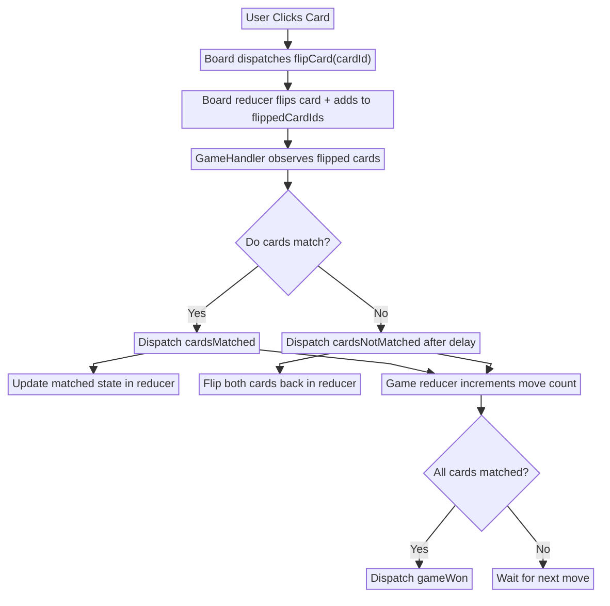

```mermaid
%%{init: {
  "theme": "default",
  "themeVariables": {
    "fontSize": "11px"
  },
  "flowchart": {
    "curve": "linear",
    "nodeSpacing": 20,
    "rankSpacing": 20,
    "padding": 2
  }
}}%%
graph TD
    A["User Clicks Card"] --> B["Board dispatches flipCard(cardId)"]
    B --> C["Board reducer flips card + adds to flippedCardIds"]
    C --> D["GameHandler observes flipped cards"]
    D --> E{"Do cards match?"}
    E -- Yes --> F["Dispatch cardsMatched"]
    E -- No --> G["Dispatch cardsNotMatched after delay"]
    F --> H["Update matched state in reducer"]
    G --> I["Flip both cards back in reducer"]
    F --> J["Game reducer increments move count"]
    G --> J
    J --> K{"All cards matched?"}
    K -- Yes --> L["Dispatch gameWon"]
    K -- No --> M["Wait for next move"]
```